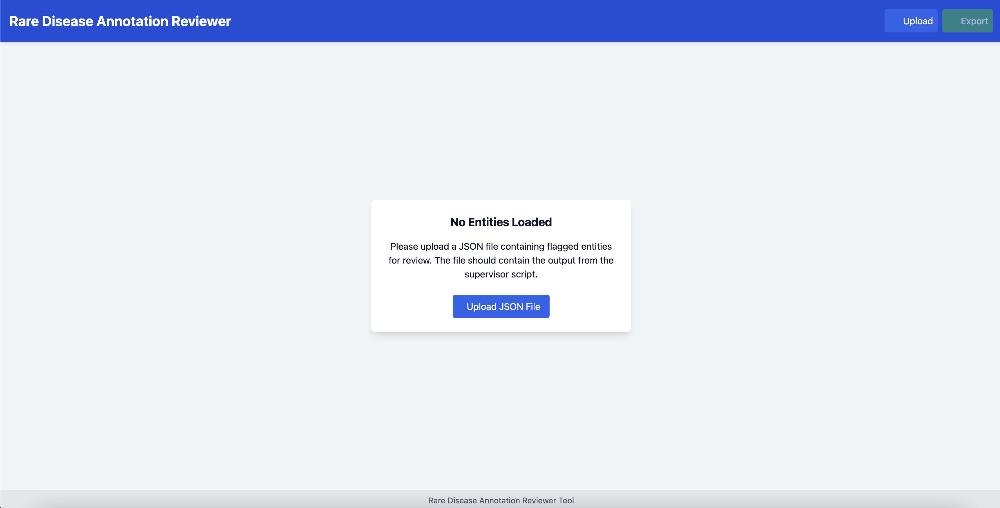
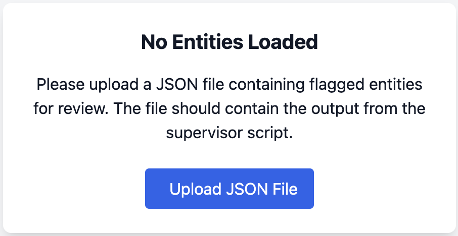
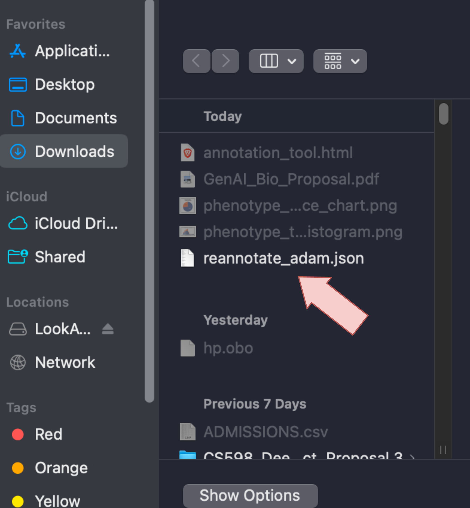
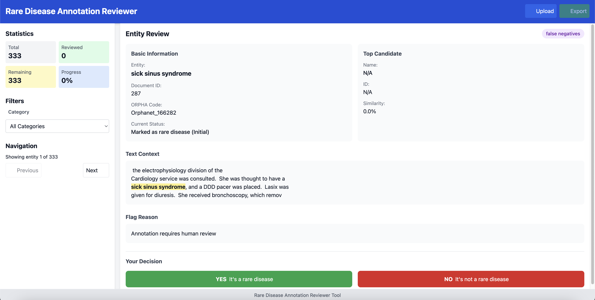
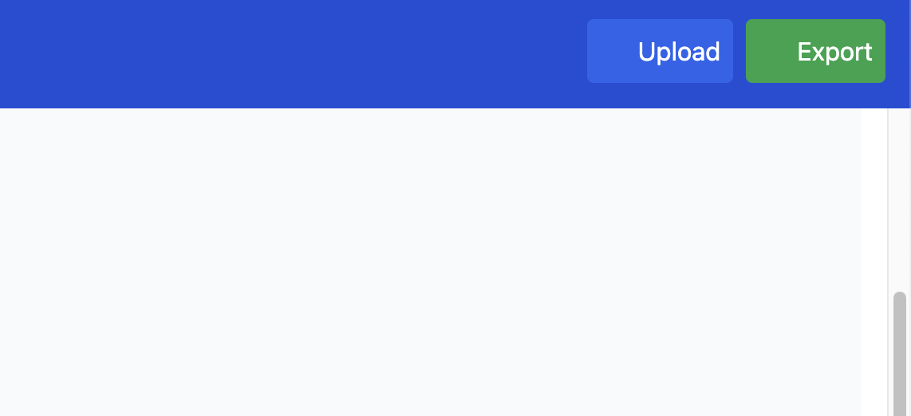

# RDMA - Rare Disease Mining Agents
Paper [here](https://arxiv.org/pdf/2507.15867)

For people who know how to use Git:

    git clone https://github.com/jhnwu3/RDMA.git

For others, on GitHub, there's a "Download Zip" button on the Green "Code" Button. You'll need to unzip manually yourself.

To get the prerequisite dependencies, please:
    
    pip install -r requirements.txt

Download these prerequisite files for the embedded documents [here.](https://drive.google.com/file/d/16wpcexHf2KDZ4w2qBHrTp8dn1oa59ABM/view?usp=sharing)

Make sure to unzip the files and place them in a location where you can reference their pathing. We offer a tools/ directory that we typically put them in. 

To see how to use RDMA, we have provided a jupyter notebook:

    example.ipynb

## Setting Up API Keys

RDMA supports running LLMs either locally (via HuggingFace) or through cloud APIs (OpenRouter, Groq). API keys are loaded from environment variables.

### Using the .env file

A `.env` template is included at the root of this repository. Fill in the keys you need:

```
# .env
OPENROUTER_API_KEY=sk-or-...
GROQ_API_KEY=gsk_...
HF_API_KEY=hf_...
ACCESS_TOKEN=hf_...
```

Then load it into your shell before running any script:

```bash
export $(grep -v '^#' .env | xargs)
```

Or set individual variables directly:

```bash
export OPENROUTER_API_KEY=sk-or-...
```

> **Note:** `.env` is listed in `.gitignore` and will never be committed. Never share this file.

### Getting an OpenRouter API Key

OpenRouter gives access to hundreds of hosted LLMs (including many free-tier models) via a single OpenAI-compatible API.

1. Sign up at [https://openrouter.ai](https://openrouter.ai)
2. Go to **Keys** in your account dashboard and create a new key
3. Copy the key (starts with `sk-or-`) into your `.env` as `OPENROUTER_API_KEY`

Free models (e.g. `nvidia/nemotron-3-super-120b-a12b:free`) require no credits. Paid models require adding credits to your account.

### Getting a HuggingFace Token

Required for downloading gated models (Llama 3, Qwen, Mistral, etc.).

1. Sign up at [https://huggingface.co](https://huggingface.co)
2. Go to **Settings → Access Tokens** and create a token with **Read** permissions
3. Copy it into your `.env` as both `HF_API_KEY` and `ACCESS_TOKEN`
4. Accept the model license on the HuggingFace model page for any gated model you want to use

---

## Running the Pipeline

### Choosing an LLM backend

All scripts accept a `--llm_type` flag:

| `--llm_type` | Description |
|---|---|
| `local` | Load a HuggingFace model locally (default). Requires a GPU and `--model_type`. |
| `api` | Use Groq API. Requires `GROQ_API_KEY`. |
| `openrouter` | Use OpenRouter API. Requires `OPENROUTER_API_KEY`. |

For `local`, pass a model name with `--model_type` (e.g. `qwen_32b`, `llama3_70b`, `mistral_24b`).

For `api` or `openrouter`, optionally pass `--api_config path/to/config.json` to reuse saved settings, or omit it to be prompted interactively (config is saved automatically for future runs).

**OpenRouter model shortcuts** (pass as `--model_type`):

| Shortcut | OpenRouter model |
|---|---|
| `nemotron-120b` | `nvidia/nemotron-3-super-120b-a12b:free` |
| `llama3-70b` | `meta-llama/llama-3.3-70b-instruct:free` |
| `qwen3-235b` | `qwen/qwen3-235b-a22b:free` |
| `deepseek-r1` | `deepseek/deepseek-r1:free` |

Raw OpenRouter model IDs (copy-pasted from openrouter.ai) are also accepted directly.

### Main pipeline scripts

These scripts run the full RDMA pipeline (extraction → verification → ORPHA matching) on a benchmark dataset.

**RareDis benchmark:**
```bash
# Local model
python scripts/run_raredis.py \
  --model_type qwen_32b \
  --gpu_id 0 \
  --embeddings_file tools/rd_orpha_medembed.npy \
  --use_abbreviations \
  --abbreviations_file tools/abbreviations_medembed_sm.npy \
  --output results/raredis_predictions.jsonl

# OpenRouter (no GPU required)
python scripts/run_raredis.py \
  --llm_type openrouter \
  --model_type nemotron-120b \
  --embeddings_file tools/rd_orpha_medembed.npy \
  --use_abbreviations \
  --abbreviations_file tools/abbreviations_medembed_sm.npy \
  --output results/raredis_predictions.jsonl


python scripts/run_raredis.py \
  --llm_type openrouter \
  --model_type nemotron-120b  --output results/raredis_nemotron_predictions.jsonl

# Debug run (2 samples only — for testing the OpenRouter client)
python scripts/run_raredis.py \
  --llm_type openrouter \
  --model_type nemotron-120b \
  --dev \
  --output results/raredis_nemotron_dev.jsonl

python scripts/run_raredis.py   --llm_type openrouter   --model_type nemotron-120b   --dev   --debug   --output results/raredis_nemotron_dev.jsonl

# Full run 
nohup python scripts/run_raredis.py \
  --llm_type openrouter \
  --model_type nemotron-120b \
  --output ../../results/raredis/nemotron_rdma.jsonl > ../../logs/raredis/nemotron_rdma.log &

```

**RDD benchmark (NER):**
```bash
python scripts/run_rdd.py \
  --task ner \
  --llm_type openrouter \
  --model_type nemotron-120b \
  --embeddings_file tools/rd_orpha_medembed.npy \
  --output results/rdd_ner_predictions.jsonl
```

**RDD benchmark (relation classification):**
```bash
python scripts/run_rdd.py \
  --task relation \
  --llm_type openrouter \
  --model_type nemotron-120b \
  --output results/rdd_relation_predictions.jsonl
```

**MIMIC-III rare disease mining** (requires MIMIC-III access):
```bash
python scripts/run_mimic3_rd_mining.py \
  --mimic3_root /path/to/mimic-iii/1.4 \
  --llm_type openrouter \
  --model_type nemotron-120b \
  --embeddings_file tools/rd_orpha_medembed.npy \
  --use_abbreviations \
  --abbreviations_file tools/abbreviations_medembed_sm.npy \
  --output results/mimic3_predictions.jsonl
```

All pipeline scripts support `--resume` to continue from a checkpoint if interrupted.

---

## Running Baselines

### Zero-shot baselines

These run a single LLM pass with no retrieval or verification.

**RareDis:**
```bash
# Local model
python baselines/zeroshot_raredis.py --model_type qwen_32b --gpu_id 0

# OpenRouter
python baselines/zeroshot_raredis.py \
  --llm_type openrouter \
  --model_type nemotron-120b \
  --output results/zeroshot_raredis.jsonl
```

**RDD (NER):**
```bash
python baselines/zeroshot_rdd.py \
  --task ner \
  --llm_type openrouter \
  --model_type nemotron-120b \
  --output results/zeroshot_rdd_ner.jsonl
```

**RDD (relation classification):**
```bash
python baselines/zeroshot_rdd.py \
  --task relation \
  --llm_type openrouter \
  --model_type nemotron-120b \
  --output results/zeroshot_rdd_relation.jsonl
```

**MIMIC-III:**
```bash
python baselines/zeroshot_mimic3_rd_mining.py \
  --mimic3_root /path/to/mimic-iii/1.4 \
  --llm_type openrouter \
  --model_type nemotron-120b \
  --output results/zeroshot_mimic3.jsonl
```

### Dictionary matching baseline (no LLM)

```bash
python baselines/run_dict_raredis.py \
  --embeddings_file tools/rd_orpha_medembed.npy \
  --output results/dict_raredis.jsonl
```

### RDRAG baseline (LLM extraction + embedding matching)

```bash
python baselines/run_rdrag_raredis.py \
  --llm_type openrouter \
  --model_type nemotron-120b \
  --embeddings_file tools/rd_orpha_medembed.npy \
  --top_k 5 \
  --output results/rdrag_raredis.jsonl
```

---

## Running Step-by-Step (rd_steps/)

For custom pipelines or finer control, you can run each stage individually.

### Step 1 — Extract entities and context

```bash
python rd_steps/step1_extract_rd_context.py \
  --input_file your_notes.json \
  --output_file step1_out.json \
  --llm_type openrouter \
  --model_type nemotron-120b \
  --entity_extractor retrieval \
  --embeddings_file tools/rd_orpha_medembed.npy \
  --top_k 10
```

`--entity_extractor` options: `llm` (plain), `retrieval` (RAG), `iterative`, `multi` (multi-temperature ensemble).

### Step 2 — Verify extracted entities

```bash
python rd_steps/step2_verify_rd_context.py \
  --input_file step1_out.json \
  --output_file step2_out.json \
  --llm_type openrouter \
  --model_type nemotron-120b \
  --embeddings_file tools/rd_orpha_medembed.npy \
  --verifier_type multi_stage \
  --use_abbreviations \
  --abbreviations_file tools/abbreviations_medembed_sm.npy
```

### Step 3 — Match to ORPHA codes

```bash
python rd_steps/step3_match_rd.py \
  --input_file step2_out.json \
  --output_file step3_out.json \
  --llm_type openrouter \
  --model_type nemotron-120b \
  --embeddings_file tools/rd_orpha_medembed.npy \
  --top_k 5 \
  --csv_output results.csv
```

### Step 4 — Supervisor (evaluation + error correction)

```bash
python rd_steps/step4_supervisor.py \
  --predictions step3_out.json \
  --ground-truth ground_truth.json \
  --evaluation step3_eval.json \
  --output supervision_out.json \
  --llm_type openrouter \
  --model_type nemotron-120b \
  --embeddings_file tools/rd_orpha_medembed.npy
```

---

## Publicly available data

We source our clinical case study annotations from the excel file from [RAG-HPO](https://github.com/PoseyPod/RAG-HPO) and provide it as a .json file in the directory: 
    
    public_data/phenotype_mining_benchmark.json

We show three variants of our MIMIC3 rare disease mention annotations. 

First, we showcase the original set from [here](https://github.com/acadTags/Rare-disease-identification/tree/main/data%20annotation)

    public_data/rd_annos.json

Next, we showcase the keyword filtered version:

    public_data/filtered_rd_annos.json

Then, we showcase the human-reannotated version:

    public_data/reannotated_rd_annos.json

To get the clinical note counterpart, please see the [MIMIC-III](https://physionet.org/content/mimiciii/1.4/) dataset.

## Using the provided annotation UI
We note that it is possible to use our existing annotation tool locally. Simply, double click or open **annotation_tool.html**, and you'll be greeted with this interface below:



Simply click the upload button and upload your .json file. 



Upload your file.




Then, you'll be greeted with the annotation display where you can click next, and declare whether or not an entity is a rare disease or not.



Once you're done, hit the green export button in the top right, it will ask to save a corrections .json file. 




Some important notes:

**Sometimes you'll see a "[Entity 'heparin induced thrombocytopenia' occurrence #1 (index 0) not found by string search or overlaps with previously used positions in document 2541 ORPHA:Orphanet_3325]", which implies the annotation entity was never found in the text"**

**Do not refresh the page or you will lose all of your progress. Do not exit on accident. There's no database or backend that's tracking your annotations.**


# My own scripts that I run for debugging:

python scripts/mimic3_rd_mining_code/run_rdma.py \
  --llm_type llama_cpp \
  --model_type nemotron-120b-q4 \
  --mimic3_root /srv/local/data/jw3/physionet.org/files/mimic-iii-clinical-database-1.4 \
  --output results/mimic3_rd_mining/nemotron-120b-q4_dev.jsonl \
  --dev --debug --condor


  nohup python scripts/raredis/eval.py --model_type llama3_8b --approach rdrag --gpu_id 0 > ../../logs/raredis/rdrag_sanity_llama3_8b.log &

  nohup python scripts/raredis/eval.py --model_type mistral_24b --approach rdrag --gpu_id 1 > ../../logs/raredis/rdrag_sanity_mistral_24b.log &


nohup python scripts/mimic3_rd_mining_text/eval.py --model_type mistral_24b --approach rdrag --gpu_id 0 --predictions_file ../../results/mimic3_rd_mining/mistral_24b_predictions.jsonl > ../../logs/mimic3_rd_mining_text/mimic3_text_sanity_mistral_24b.log &


nohup python baselines/raredis/rdrag.py --model_type mistral_24b --gpu_id 1 > ../../logs/raredis/rdrag_rerun_mistral_24b.log &


python eval.py --predictions ../../../results/biolarkgsc/mistral_24b_predictions.jsonl --inspect --output ../../../results/biolarkgsc/mistral_24b_per_doc.csv

nohup python eval.py --predictions /home/johnwu3/projects/rare_disease/workspace/results/biolarkgsc/mistral_24b_predictions.jsonl --inspect --output /home/johnwu3/projects/rare_disease/workspace/results/biolarkgsc/mistral_24b_per_doc.csv > inspect_rdma.log &


nohup python eval.py --predictions /home/johnwu3/projects/rare_disease/workspace/results/biolarkgsc/gpt-5-john_predictions.jsonl --inspect --output /home/johnwu3/projects/rare_disease/workspace/results/biolarkgsc/gpt5_per_doc.csv > inspect_rdma_gp5.log &


python scripts/biolarkgsc/run_hpo.py --model_type qwen3_32b --llm_type local --debug --dev --condor --checkpoint_interval 1 --output /home/johnwu3/projects/rare_disease/workspace/results/biolarkgsc/qwen3_32b_debug_dev.jsonl